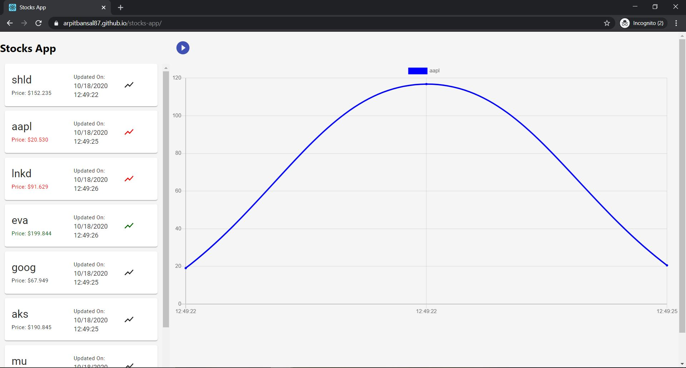
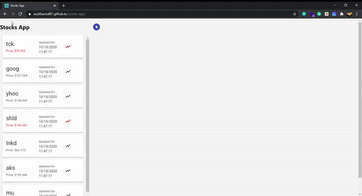

# Stocks Listing App

An app to show all the stocks currenlty listed. History of the stocks being showed through line chart



## Project Demo



## Features

- [x] Listing of Stocks to be recievd from ws://stocks.mnet.website using middleware server.
- [x] Chart for the history of the stock to show value
- [x] Pause/Play recording of the history
- [x] Backend server created as middleware to connect to avoid mixed content error from secure website.
- [x] Indicator to show increase/decrease in stock value
- [x] UI features Eg. tooltips

## TODO

- [] Re-evaluate the data when the instances of changes are huge. 
- [] Zoom for chart
- []

## API return format

```

[
  [name, price],
  [name, price]
]

```
Examlpe of the data
```
[
  ["aapl", 41.63329213409408], 
  ["goog", 75.52282936965123], 
  ["aapl", 17.97219389900667]
]

```

## Build with

This section should list any major frameworks that you built your project using.

- [React.js]

## 🚀&nbsp; Installation

Stocks Listing App requires [Node.js](https://nodejs.org/) v12+ to run.

Install the dependencies after cloning the repo and start the server.

```sh
$ git clone https://github.com/ArpitBansal87/stocks-app.git
$ yarn install / npm install
$ yarn start / npm run start

```

## 🤝&nbsp; Found a bug? Missing a specific feature?

Feel free to **file a new issue** with a respective title and description on the the [Stocks App](https://github.com/ArpitBansal87/stocks-app/issues) repository. If you already found a solution to your problem, **we would love to review your pull request**! 

## Contributions

Contributions are what make the open source community such an amazing place to be learn, inspire, and create. Any contributions you make are **greatly appreciated**.

1. Clone the Project
2. Create your Feature Branch (git checkout -b feature/AmazingFeature)
3. Commit your Changes (git commit -m 'Add some AmazingFeature')
4. Push to the Branch (git push origin feature/AmazingFeature)
5. Open a Pull Request

  [react.js]: https://reactjs.org/
  [deployment-link]: https://www.npmjs.com/package/
